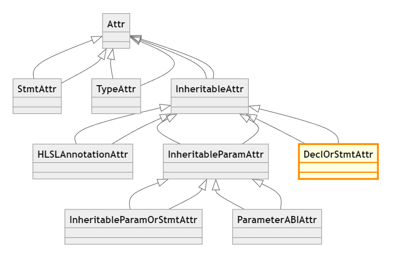
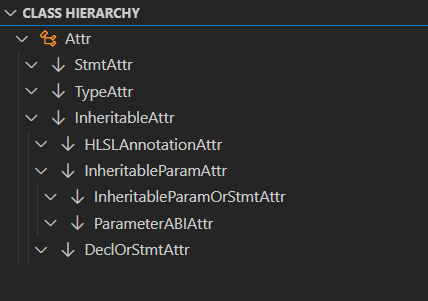

# C++ Class Insight

This tool visualizes the hierarchy of C++ classes in your project, displaying both class hierarchy diagrams and a tree view of the class structures. 
It generates three types of views:

- Overall Class Hierarchy
- Base Class Hierarchy (Supertypes)
- Derived Class Hierarchy (Subtypes)

<!--  -->

## Prerequisites

- `clangd` (C++ language server)
- compiling your C++ project using `clang` (can be easily done via the `CMake Tools` extension in VS Code)

## Usage

1. Place your cursor on a target class.
2. Open the command palette by pressing `Shift + Ctrl + P`.
3. Select one of the following commands:
   - **Show Class Hierarchy**: Displays the entire class hierarchy.
   - **Show Class Hierarchy - Supertypes**: Displays the base class hierarchy (supertypes).
   - **Show Class Hierarchy - Subtypes**: Displays the derived class hierarchy (subtypes).
   
   *(We recommend setting custom keyboard shortcuts for quicker access.)*

## How it works

This tool leverages `clangd` (C++ language server) and the Mermaid diagram generator to create class hierarchy diagrams.

Enjoy visualizing your C++ class hierarchies with ease!